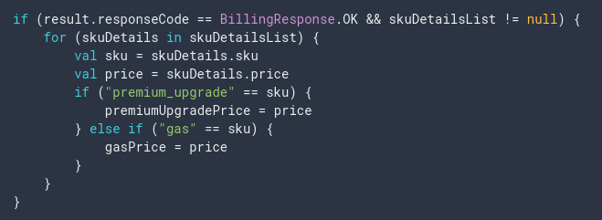

# Google Play Billing
- Google Play Billing là một dịch vụ bán nội dung số trên Android.

## In-app product types
- One-time products: ví dụ game levels, media files...

- Rewarded products: như là extra lives, tiền tệ trong game,...

- Subscriptions: như là tạp chí online, music streaming services,...

## Purchase tokens and order IDs
- Purchase token: là một chuỗi đại diện cho quyền lợi cuả người mua đối với sản phẩm trên Google Play, nó chỉ ra rằng người dùng đã thanh toán cho một sản phẩm cụ thể, đại diện bởi SKU.
- Order ID: là một chuỗi đại diện cho một giao dịch tài chính trên Google Play. Chuỗi này được kèm trong biên lai được gửi qua email tới người mua và nhà phát triển bên thứ 3 sử dụng oder ID để quản lý tiền hoàn lại trong Order Manager của Google Play Store.Ngoài ra, nó cũng được sử dụng trong sales và payout reports.

## In-app product configuaration options
- Title: mô tả ngắn về sản phẩm trong ứng dụng.
- Description: mô tả chi tiết về sản phẩm trong ứng dụng.
- Product ID: là id duy nhất định danh product, nó còn được gọi là SKUs trong Google Play Billing Library.
- Price/ Default Price: Số tiền mà người dùng phải trả cho product trong ứng dụng
  + One-time product: Giá mặc định được tính cho khách hàng mỗi lần cho mua product.
  + Rewarded purchases: Không phải trả phí thay vào đó người dùng xem quảng cáo
  + Subscription: Giá mà khách hàng phải trả theo định kỳ.
 - Tham khảo thêm <a href="https://developer.android.com/google/play/billing/billing_overview#unique-one-time-product-configuration-options">tại đây</a>

# Các bước tích hợp In-app billing trong một ứng dụng

## Add Google Play Billing in app
### Step 1: Update your app's dependencies
 

 
### Step 2: Connect to Google Play
- Tạo một instance cho **BillingClient**.
- Phải gọi **setListener()** thông qua **PurchasesUpdatedListener** để nhận các cập nhật về các giao dịch mua được tạo bởi app, cũng như do Google Play Store khởi tạo.
- Implement **BillingClientStateListener** để nhận một callback sau khi thực hiện quá trình kết nối.

 
### Step 3 Query for in-app product details.
- Query Google Play để lấy thông tin chi tiết product gọi **querySkuDetailsAsync()**.
- Tham số truyền vào là một **SkuDetailsParams** chỉ định một danh sách chuỗi product ID và **SkuType** (INAPP, SUBS).
 
 
 
- Xử lý kết quả trả về trong **onSkuDetailsResponse()** bằng cách implements **SkuDetailsResponseListener**. Kiểm tra **responseCode** xem kết quả trả về:
    + Thành công (BillingResponse.OK): Trả về một danh sách các đối tượng SkuDetails
    + Nếu xảy ra lỗi: có thể sử dụng **getDebugMessage** để xem thông tin lỗi.
- Tham khảo thêm responseCode: <a href="/reference/com/android/billingclient/api/BillingClient.BillingResponse"><code translate="no" dir="ltr">BillingClient.BillingResponse</code></a>
    

### Step 4: Enable the purchase of an in-app product
- Một số thiết bị Android có version cũ hơn Google Play Store sẽ không hỗ trợ một số product nhất định (như là subscriptions). Vì thế, trước khi billing flow hãy kiểm tra xem device có hỗ trợ các sản phẩm bạn muốn bán không **isFeatureSupported()**
- Gọi **launchBillingFlow()** từ UI thread để bắt đầu yêu cầu mua từ app. Tham số truyền vào là một **BillingFlowParams**

- Method **launchBillingFlow** trả về một danh sách **responseCode** và một danh sách đối tượng **Purchase** trong method **onPurchasesUpdated** được override lại từ **PurchasesUpdatedListener**

### Acknowledge a purchase
- Từ Google Play Billing Library version 2.0 trở lên, bạn phải xác nhận tất cả các giao dịch mua trong vòng 3 ngày, nếu không xác nhận thì giao dịch sẽ được hủy bỏ, người dùng được hoàn lại tiền. Chỉ áp dụng khi giao dịch mua chuyển sang trạng thái SUCCESS, không áp dụng ở trạng thái PENDING.
- Đối với các giao dịch mua được thực hiện bởi license testers, thời gian xác nhận sẽ ngắn hơn chỉ 5 phút.
- Google Play hỗ trợ mua sản phẩm cả bên trong và bên ngoài ứng dụng. Để đảm bảo quá trình mua nhất quán, bạn phải thừa nhận rằng tất cả các giao dịch mua có trạng thái SUCCESS nhận được thông qua thư viện Google Play Billing càng sớm càng tốt.
- Xác nhận mua hàng bằng cách sử dụng một trong các cách sau:
    + Đối với các sản phẩm tiêu thụ: sử dụng **consumeAsync()**
    + Đối với các sản phẩm không thể tiêu thụ: sử dụng **acknowledgePurchase()**
    + Một phương thức mới: **acknowledge()**
- Đối với Subscriptions, phải xác nhận bất kỳ giao dịch mua nào có chứa **purchase token** mới.
- Để kiểm tra xem giao dịch mua đã được xác nhận chưa sử dụng **isAcknowledge()**
- Ví dụ về xác nhận giao dịch mua một Subscription:

### Verify a purchase
- Bạn luôn phải xác minh rằng trạng thái mua hàng là PURCHASED và các chi tiết mua hàng khác mà ứng dụng của bạn nhận được trong **onPurchaseUpdated** trước khi cung cấp cho người dùng quyền truy cập vào những sản phẩm họ đã mua.
#### Verify a purchase on a server
- Xác minh mua hàng mua hàng trên server, giúp bạn bảo vệ ứng dụng của mình khỏi những kẻ tấn công cố gắng thiết kế ngược tệp APK và vô hiệu hóa logic xác minh.

- Tham khảo: <a href="https://developer.android.com/google/play/billing/billing_library_overview#Verify-purchase"><code translate="no" dir="ltr">Verify a purchase on a server</code></a>

#### Verify a purchase on a device
- Nếu bạn không chạy server thì bạn vẫn có thể xác thực các purchase detail trong app của bạn.
- Google Play sẽ ký chuỗi JSON chứa response data của giao dịch mua. Để nhận chuỗi JSON này sử dụng **getOriginalJson()** trong **Purchase**. Google Play sử dụng Key riêng được liên kết với app của bạn trong Play Console để tạo chữ ký này. 
- Google Play Console tạo cặp khóa RSA (được mã hóa Base64) cho mỗi app. Khi nhận được response đã ký này, bạn có thể sử dụng public key của cặp khóa RSA để xác minh.
- Bạn nên xáo trộn public key và mã Google Play Billing để tránh bị tấn công.

- Tham khảo: <a href="https://developer.android.com/google/play/billing/billing_library_overview#Verify-purchase-device"><code translate="no" dir="ltr">Verify a purchase on a device</code></a>

## Generate APK/ AppBundle
- Generate variant release với các cấu hình tương ứng
- Đảm bảo app đã được cấp quyền: <uses-permission android:name="com.android.vending.BILLING" />
- Nếu là app mới đưa lên chợ, cần tạo một keystore mới.

## Upload app to Google Play Console
- Bạn cần phải có tài khoản Google Play Console <a href="https://support.magplus.com/hc/en-us/articles/204270878-Android-Setting-up-Your-Google-Play-Developer-Account">xem hướng dẫn tại đây</a>
- Trong bảng điều khiển chọn: All Application -> Create Application -> Enter title and create.
- Nếu chỉ cần test mà không cần đẩy hẳn lên Store thì chỉ cần sử dụng Internal Test Track là đủ. Cách cấu hình: App Releases -> Internal test track -> Create Release -> Upload signed apk -> Save - Review.
- Điền đầy đủ các mục như **Store listing, Content rating, Pricing & distribution** sau đó chọn **START ROLLOUT TO BETA** để public app ở dạng Test.

## Prepare products
### Add one-time product
- Google Play Billing hỗ trợ 2 loại one-time products:
    + Non-consumable: Là các product sử dụng vĩnh viễn (giáp, khiên,...)
    + Consumable: Là các product tạm thời, có thể mua lại (máu, mana,...)
- Để chỉ ra rằng một one-time product đã được tiêu thụ, gọi **consumeAsync** từ instance **BillingClient**, kết quả trả về thông qua **ConsumeResponseListener**.

- Quá trình giao dịch mua thành công cũng tạo ra một **purchase token*.
- Ngoài ra bạn bạn có thể tạo mã khuyến mãi **promo code**.

- Hướng dẫn: <a href="https://support.google.com/googleplay/android-developer/answer/1153481">Create a one-time product</a>

### Add rewarded product
- Một cách mang đến lợi ích cho người dùng. Các **rewarded products** hoặc các item người dùng có thể nhận được sau khi xem các video quảng cáo.
- Các sản phẩm được thưởng này là các sản phẩm được tiêu thụ (comsume) để người dùng có thể nhận được nhiều lần.
- Để hiện thị video quảng cáo, sử dụng method **loadRewardedSku()** truyền vào đối tượng **RewardLoadParams** và kết quả trả về thông qua **RewardResponseListener**.
- Các quảng cáo phải phù hợp với lứa tuổi mà app hướng đến.

- Quy trình làm việc của rewarded product:

- Hướng dẫn cách tạo Rewarded product: <a href="https://developer.android.com/google/play/billing/billing_library_overview#Verify-purchase-device">Create a rewarded product</a>

### Add subscription
- Subscriptions được cấu hình bằng Google Play Console, có một số đặc điểm như là thời hạn thanh toán, thời gian dùng thử,...
- Bạn nên bật real-time developer notification để nhận các thông báo kịp thời về những thay đổi của các Subscription. Xem thêm <a href="https://developer.android.com/google/play/billing/realtime_developer_notifications.html">Add real-time developer notifications</a>
- Một số trường hợp sử dụng Subscription mà bạn nên thử cung cấp các giải pháp trong Google Play Billing của mình:
    + Xử lý các trạng thái liên quan đến đăng ký bằng real-time developer notification
    + Tạm dừng một Subscription
    + Cho phép người dùng đăng ký lại theo cách thủ công khi đăng ký đã bị hủy trước khi thời gian đăng ký kết thúc.
    + Cung cấp một mã khuyến mãi dùng thử
    + Cho phép user upgrade hoặc downgrade một Subs
    + Hoàn lại chi phí một Subs
    + Thu hồi một Subs
    + Hủy đăng ký
    + Khôi phục đăng ký
    + Trì hoãn thanh toán cho người dùng để đăng ký miễn phí trong một khoảng thời gian nhất định.
    + Giành lại một khách hàng

- Tham khảo thêm: 
  + <a href="https://developer.android.com/google/play/billing/billing_subscriptions">Add subscription-specific features</a>
  + <a href="https://support.google.com/googleplay/android-developer/answer/140504">Create a subscription</a>
  
## Test Google Play Billing
- Publish app của bạn lên Store có thể mất thời gian để hoàn thành quá trình upload trước khi có thể test.
- Có thể test trên mọi thiết bị Android từ 1.6 trở lên. Version mới nhất của Google Play phải được cài trên device.

- Chi tiết: <a href="https://developer.android.com/google/play/billing/billing_testing">Test Google Play Billing</a>
  
# Source
 - Android Developer: https://developer.android.com/google/play/billing/billing_library_overview#acknowledge
 - Medium:
  + https://medium.com/@vleonovs8/tutorial-google-play-billing-in-app-purchases-6143bda8d290
  + https://medium.com/exploring-android/exploring-the-play-billing-library-for-android-55321f282929
